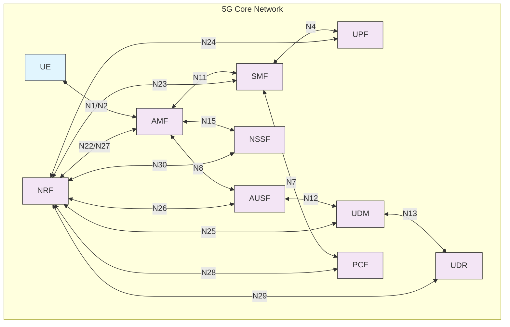
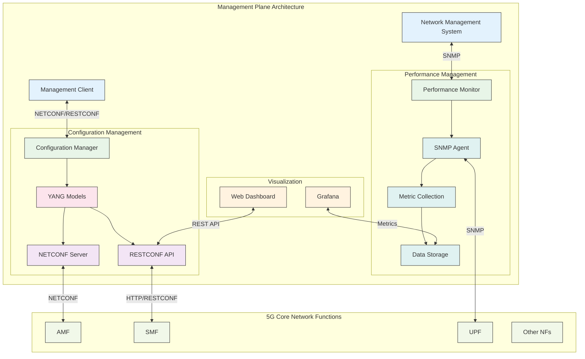
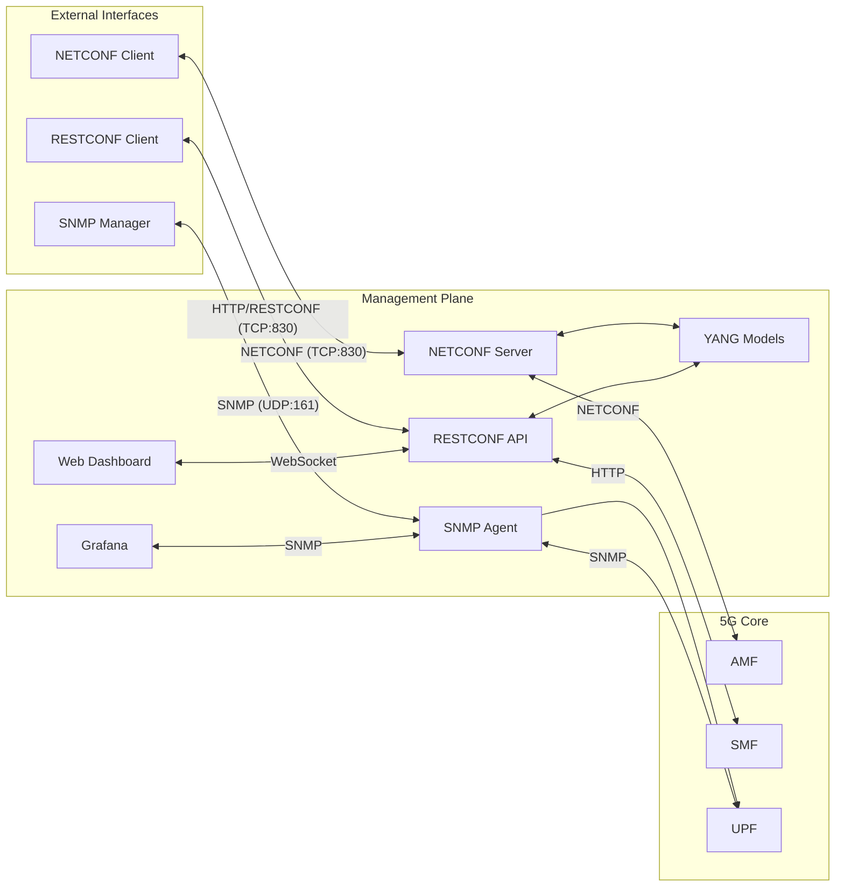

# 5G Core Management Prototype - Architecture Diagrams

## Diagram 1: 5G Core Architecture

```mermaid
graph TB
    subgraph "5G Core Network"
        A[UE] <-- N1/N2 --> B[AMF]
        B <-- N11 --> C[SMF]
        C <-- N4 --> D[UPF]
        B <-- N8 --> E[AUSF]
        E <-- N12 --> F[UDM]
        F <-- N13 --> G[UDR]
        B <-- N15 --> H[NSSF]
        C <-- N7 --> I[PCF]
        J[NRF] <-- N22/N27 --> B
        J <-- N23 --> C
        J <-- N24 --> D
        J <-- N26 --> E
        J <-- N25 --> F
        J <-- N29 --> G
        J <-- N30 --> H
        J <-- N28 --> I
    end

    style A fill:#e1f5fe
    style B fill:#f3e5f5
    style C fill:#f3e5f5
    style D fill:#f3e5f5
    style E fill:#f3e5f5
    style F fill:#f3e5f5
    style G fill:#f3e5f5
    style H fill:#f3e5f5
    style I fill:#f3e5f5
    style J fill:#f3e5f5

    classDef core fill:#f3e5f5,stroke:#333;
    classDef ue fill:#e1f5fe,stroke:#333;

    class A ue
    class B,C,D,E,F,G,H,I,J core
```

## Diagram 2: Management Plane Architecture

```mermaid
graph TB
    subgraph "Management Plane Architecture"
        A[Management Client] <-- NETCONF/RESTCONF --> B[Configuration Manager]
        C[Network Management System] <-- SNMP --> D[Performance Monitor]
        
        subgraph "Configuration Management"
            B --> E[YANG Models]
            E --> F[NETCONF Server]
            E --> G[RESTCONF API]
        end
        
        subgraph "Performance Management"
            D --> H[SNMP Agent]
            H --> I[Metric Collection]
            I --> J[Data Storage]
        end
        
        subgraph "Visualization"
            K[Grafana] <-- Metrics --> J
            L[Web Dashboard] <-- REST API --> G
        end
    end
    
    subgraph "5G Core Network Functions"
        M[AMF]
        N[SMF]
        O[UPF]
        P[Other NFs]
    end
    
    F <-- NETCONF --> M
    G <-- HTTP/RESTCONF --> N
    H <-- SNMP --> O
    
    style A fill:#e3f2fd
    style B fill:#e8f5e8
    style C fill:#e3f2fd
    style D fill:#e8f5e8
    style E fill:#fce4ec
    style F fill:#f3e5f5
    style G fill:#f3e5f5
    style H fill:#e0f2f1
    style I fill:#e0f2f1
    style J fill:#e0f2f1
    style K fill:#fff3e0
    style L fill:#fff3e0
    style M fill:#f1f8e9
    style N fill:#f1f8e9
    style O fill:#f1f8e9
    style P fill:#f1f8e9

    classDef client fill:#e3f2fd,stroke:#333;
    classDef manager fill:#e8f5e8,stroke:#333;
    classDef models fill:#fce4ec,stroke:#333;
    classDef config fill:#f3e5f5,stroke:#333;
    classDef perf fill:#e0f2f1,stroke:#333;
    classDef viz fill:#fff3e0,stroke:#333;
    classDef nf fill:#f1f8e9,stroke:#333;

    class A,C client
    class B,D manager
    class E models
    class F,G config
    class H,I,J perf
    class K,L viz
    class M,N,O,P nf
```

## Diagram 3: System Component Interaction

```mermaid
graph LR
    subgraph "External Interfaces"
        A[NETCONF Client]
        B[RESTCONF Client]
        C[SNMP Manager]
    end

    subgraph "Management Plane"
        D[NETCONF Server]
        E[RESTCONF API]
        F[SNMP Agent]
        G[YANG Models]
        H[Web Dashboard]
        I[Grafana]
    end

    subgraph "5G Core"
        J[AMF]
        K[SMF]
        L[UPF]
    end

    A <-- "NETCONF (TCP:830)" --> D
    B <-- "HTTP/RESTCONF (TCP:830)" --> E
    C <-- "SNMP (UDP:161)" --> F
    D <--> G
    E <--> G
    F --> L
    H <-- "WebSocket" --> E
    I <-- "SNMP" --> F
    D <-- "NETCONF" --> J
    E <-- "HTTP" --> K
    F <-- "SNMP" --> L
```